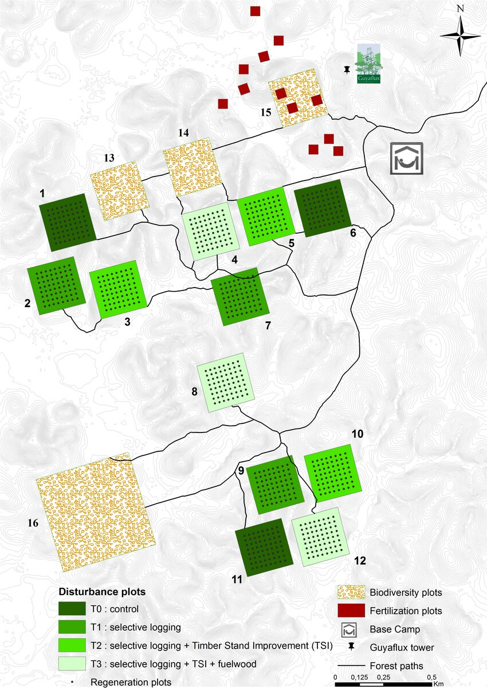



# Matériel et méthodes

## Acquisition des données

Les données sur lesquelles nous avons travaillé sont issus du dispositif expérimental du de Paracou en Guyane française. Cet ensemble de parcelles est monitoré principalement par le CIRAD et l’UMREcofog avec l’association de l’ONF, Organisme national des forêts. Il est localisé à quelques 50km de la ville de Kourou en région côtière, au milieu de la forêt (plus précisément aux coordonnées 5.18, -52.53) près de Sinnamary. En 1984, avec pour objectif d’étudier l’effet de pression anthropique sur les forêts basse tropicales, 12 parcelles de 250m sur 250m soit 6.25ha sont mise en place dans le domaine de Paracou (40 000 ha de forêt, dont une partie fut loués au Cirad par le Centre National d’études Spatiales). En effet situé au cœur de la forêt non perturbée du bouclier des guyanes, ces parcelles compte environ 800 essences d’arbres clairement identifié @cirad .Les parcelles qui nous intéresses ont été rajoutées en 1990, elles ont une superficie de 6,25ha pour la n°13, n°14, n°15 et de 25ha (500m par 500m) pour la n°16, la plus grande parcelle du dispositif.

Ces parcelles sont situées dans des zones ou aucune perturbations humaines n’a eu lieu ou est autorisée, elles sont utilisées pour mesurer la biodiversité des forêts primaires. Sur toutes les parcelles du dispositif un inventaire est réaliser tout les 1 à 2ans, il consiste en l’identification des espèces d’arbres (espèce/genre/famille, parfois indéterminé, le nom de identificateur), leur localisation (coordonnées GPS et sur la parcelle) et la mesure de nombreuses données comme le diamètre à hauteur de poitrine (130cm), la mortalité, certains trait foliaires, la circonférence à la base, … Ces campagnes d’inventaires sont réalisées depuis plus de 35ans fournissent une base de données solides pour d’éventuelles études scientifiques, ce qui permets de réaliser un suivi de l’évolution des dynamiques forestières en zone perturbées ou non. La parcelle 16 de part sa taille nécessite un équipe de 6personnes qui travaillent pendant 6mois pour recenser touts les arbres en son sein. Ce travail n’est effectué que tout les 5ans car le but de cette parcelle est moins d’étudier les changement à court termes que la biodiversité. Pour cette raison nous avons travaillé sur les données des inventaire de 2015, car c’est la seule année ou des inventaires complets ont été réalisé en même temps sur suffisamment de parcelles similaires, exemptes de toutes perturbations : les parcelles 15,16 et 6. La parcelle 6 est un des témoins issus de la mise en place initial du dispositif de Paracou, où l’on cherchais à mesurer l’impact des perturbations de la sylviculture sur les forêts. Sur les parcelle d’expérimentation on retrouve différents modalité de coupe d’essence de bois d’intérêt économique ainsi que l’élimination des essences non essentielles ou abîmées, par poison.

Pour notre étude seules les données des parcelles nous touchées nous intéressait, nous avons donc choisis les parcelles 6, 15 et 16, avec un focus sur la n°16, qui est plus grande et plus diverse. Une fois aploadé dans Rstudio, nous avons recréer un nom binomial a partir des colonnes d’identification présentes. Il est formé de la combinaison du nom de genre et d’espèce.Nous avons utiliser seulement les données concernant le diamètre à 1,30m afin de calculer la surface terrière $G$ de chaque arbres, tout en rectifiant cette mesure pour prendre en compte les contreforts.

$$G = \frac{\pi D^2}{4000}$$\

où :\
\
- $G$ est la surface terrière (m²) ;\
- $D$ est le diamètre à hauteur de poitrine (DBH, soit 130cm), exprimé en centimètres

Les espèces indéterminées sont prise en compte que ce soit au niveau de l’espèce ou que l’on ai aucune idée ni de leur genre ni de leur espèces. Étant dans un contexte d’étude la biodiversité et de ses courbes d’accumulation, les espèces avec peu de représentant on un poids moindres dans les calculs de courbes et/ ou d’indices. Les espèces indéterminées le sont souvent car elles appartiennent à des espèces rare encore peu décrites voire jamais identifiées. Ces individus sont donc peu représentes au niveau spécifique et leur intégration à l’analyse n’as que peu d’incidence. Le cas des arbres mort à aussi été questionné, pour le calcul des courbes d’accumulations ont a choisi de garder les arbres mort dans nos données. En effet ceux-ci sont comptabilisé lors des inventaires seulement si ils tiennent encore debout, (les chablis et arbres au sol sont écartés des inventaires). La mort de ces arbres est donc relativement récente, leur presciences à impacté la biodiversité locale de leur vivant il y a encore quelque années et l’effet de l’arbre mort est encore visible. Il est donc pertinent voir non négociable les prendre en compte comme si la sève coulait encore en leur sein.

## Courbes d’accumulation et mesure de diversité

### Diversité d’ordre 0 et 2

les indices de diversité utilisé lors de l’analyse des données ne sont pas des plus complexes mais ils restent très efficaces dans la mesure de la biodiversité. L’indice d’ordre 0 désigne la richesse spécifique autrement dit : le nombre stricte d’espèces présentent dans une communauté (ici dans nos parcelles). L’indice d’ordre 2 désigne l’indice de l’equitabilité de Simpson, $\lambda$ donne plus de poids aux espèces abondantes (contrairement à l’indice de Shannon). Il matérialise la probabilité que deux individus tirés au hasard appartiennent à la même espèce.

$$\lambda = \sum_{i=1}^{S} p_i^2$$

où :\
\
- $S$ est le nombre total d'espèces ;\
- $p_i$ est la proportion d'individus appartenant à l'espèce $i$, telle que\
\
p_i = \\frac{n_i}{N}\

$$p_i = \frac{n_i}{N}$$\
\
avec :\
\
- $n_i$ Le nombre d'individus de l'espèce $i$ ;\
- $N$ Le nombre total d'individus de la communauté.

Il mobilise donc la notion d’abondance, qui représente le nombre d’individus par espèces. Absente dans la richesse spécifique, elle apporte une dimension essentielle à l’analyse, particulière dans les foret tropicales qui sont fortement hétérogène en composition, avec des espèces ultras dominantes et des taxons représente par 1 ou 2 individus.

###  **Nombres de Hill**

Les nombres de Hill ou "nombre effectif d’espèces" nous a servi à exprimer les résultats . Il les rends interprétables instinctivement en traduisant un indice de diversité par une communauté hypothétique équivalente où chaque espèce serai en proportion équiprobable @chao2013. Pour la diversité d'ordre 0 ou richesse spécifique, le nombre de Hill correspond exactement à cette même richesse. Pour la diversité d'ordre 2, soit Simpson, il correspond à :

$${}^2D=\frac{1}{\lambda}$$

## **Les ISARS**

### Formule

Le cœurs de se stage mobilise les calculs d’isars introduit par @wiegand2007 . Dans l’article “How individuals species structures biodiversity in tropical forests”, il cherche à apporter des outils méthodologiques capable de mieux apprehender la biodiversité étonnamment riche des forêt tropicales.

Les “ISAR”, individuals species-area relationships (traduit par moi même : courbes d’accumulation individuelles) désignent des courbes d’accumulation qui au lieu de classiquement augmenter l’effort échantillonnage parte d’un individu et augmente le rayon autour de celui-ci. Sur une parcelle de type Paracou ou chaque arbre est identifié et géolocalisé précieusement, ont peut réaliser de très nombreux ISAR. Chaque la courbe d’accumulation est réalisé pour chaque individus en augmentant le rayon autour de celui-ci, puis une moyenne des données par espèce et par rayon permet de construire des courbes plus ou moins représentatives statistiquement.

L'ISAR d'une espèce $i$ à une distance $r$ est défini comme :

$$ISAR(r) = \sum_{j=1}^{N}[{1-P_{ij}(0,r)]}$$

où :

- $N$ est le nombre total d'espèces présentes dans la communauté ;

- $P_{ij}(0,r)$ est la probabilité que l'espèce $j$ soit absente d'un disque de rayon $r$ centré sur un individu de l'espèce cible $i$.

###  **Processus ponctuels**

Les processus ponctuels désignent des motifs ou des patrons de répartition des points dans l’espace. Les données de Paracou se prêtent parfaitement à un analyse de ce type. En effet on peut obtenir des objets de type wmppp : un pattern de point sur 2 dimensions associé à un tableau de \$marks caractérisant chaque point par des “pointWeight”, ici surface terrière et “PointType” : espèce. Ce type d’objet convient parfaitement à l’analyse des processus ponctuels par comparaison.

Au lieu d’utiliser simplement les courbes d’accumulation, @wiegand2007 les couples avec le $K$ de @ripley1976 .

La fonction $K_{ij}(r)$ de Ripley décrit le nombre moyen d'individus de l'espèce $j$ situés dans un rayon $r$autour d'un individu de l'espèce $i$, après correction par la densité de l'espèce $j$. Elle est définie par :\
\
\$\$\
K\_{ij}(r)=\\frac{1}{\\lambda_j}\
E\\!\\left\[N_j(r)\\right\]\
\$\$\

$$K_{ij}(r)=\frac{1}{\lambda_j}
E\!\left[N_j(r)\right]$$\

où :\
- $K_{ij}(r)$ est la fonction $K$ interspécifique ;\
- $\lambda_j$ est la densité de l'espèce $j$ ;\
- $N_j(r)$ est le nombre d'individus de l'espèce $j$ présents dans un disque de rayon $r$ centré sur un individu de l'espèce $i$.\

Cela nous permets de comparer la distribution de individus sur la parcelle avec une distribution hypothétique aléatoire. Dans notre étude nous les avons comparé à une distribution h0 “random location”, dans laquelle les étiquettes d’espèces serait distribué au hasard nom de la distribution. Ce processus permets de tenir compte de la topographie du terrain : de ne pas placer un arbres sur un rocher ou dans une rivière mais aussi de tenir compte des microenvironnenment comme un sol plus fertile, un lit de rivière, une vallée, … qui peuvent influer sur le placement et l’abondance locale. @walter

## **Packages et Rstudio**

Le logiciel Rstudio fut l’outil principal du stage, il fut couplé à l’utilisation de Git et github, nous permettant de travailler à plusieurs sur un même code, de partager des infos et de travailler sur plusieurs ordinateurs en même temps. Lors du calculs des ISARS, il a été nécessaire d’utiliser les ordinateur d’Agro Paris Tech, en effet les algorithmes sont extrêmement exigeant en ressources. Sans ces ordinateurs équipés des composants hautes performances, les temps de calculs serait passée de plusieurs jours à des semaines entières. Git m’a permis d’avancer sur le rapport, le code et l’analyse tout en laissant les ordinateurs adaptés effectuer mes calculs.

Quarto me fut aussi d’une grande aide dans la rédaction du présent rapport. C’est un système de publication scientifique qui s’actualise au fur et à mesure que le projet avance. Il s’intègre à l’interface de Rstudio et permet de produire des documents PDF tels que des rapports, des pages internet combinant code, tableaux, résultats, graphique et paragraphes de texte.

De nombreux packages furent utilisés lors de ce stage et on ne les citera pas (voir annexes si vous avez quand même envi de savoir). Si l’on devait parler d’un seul, on détaillerai le package *divent* (issu du package entropart). Développé et constamment amélioré par Eric Marcon ( mon maître de stage, le boss). Nos analyses ont reposé principalement sur ce package qui “fourni des fonctions permettant d’estimer les diversité alpha, bêta et gamma des communautés en incluant la diversité phylogénique et fonctionnelle” @marcon . La fonction du package *divent*, accum_sp_hill nous a permis de réaliser le complexe calcul des isars en réglant diverse paramètres pour les adapté à notre cas biologique. Le rayon choisi est de r = 30m car des études que les effets du voisinage sur la croissance et la survie sont relativement puissant jusqu’à 30m @wiegand2007 , mesure au delà de laquelle ils s’estompent. De plus, d’un point de vu technique il était impossible de calculer des isar sur des rayon dépassant 50m par manque de temps (un calcul sur 30m pouvant prendre 2j). Le paramètre de correction des effets de bords “Ichao1” @Chao2014 fut choisi car il estime la diversité totale en fonction du nombre d’espèce rare observée (très présentes en forêt tropicale), il prend en compte les singletons, doubletons, tripletons et quadrubletons dans son estimation de la diversité comme une mesure de la probabilité que d’autres espèces soit passées inaperçues.

Lorsque $f_2 > 0$, l'estimateur iChao1 s'écrit :

$$\widehat{S}_{iChao1}
=
\widehat{S}_{Chao1}
+
\frac{f_3}{4 f_4}
\max \left(
f_1 - \frac{f_2 f_3}{2 f_4},
0
\right)$$

où :

- $\widehat{S}_{iChao1}$ est l'estimateur iChao1 de la richesse spécifique ;
- $\widehat{S}_{Chao1}$ est l'estimateur Chao1 classique ;
- $f_1$ , $f_2$, $f_3$ et $f_4$ sont respectivement le nombre de singletons, doubletons, tripletons et quadrupletons

Les courbes d’accumulation ainsi obtenue sont rendu sur des graphiques avec une unité arbitraire de diversité. L’intérêt étant de les comparer entre elles. Mais ce que l’on va surtout effectuer c’est la comparaison l’hypothèse h0 d’accumulation ou toutes les isars indifféremment de l’espèce sont rassemblés avec les isars spécifiques.
